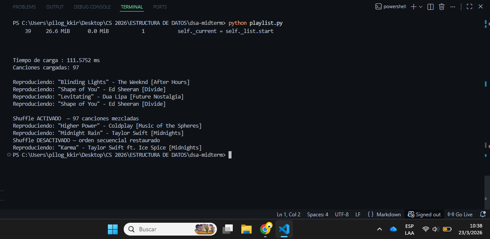
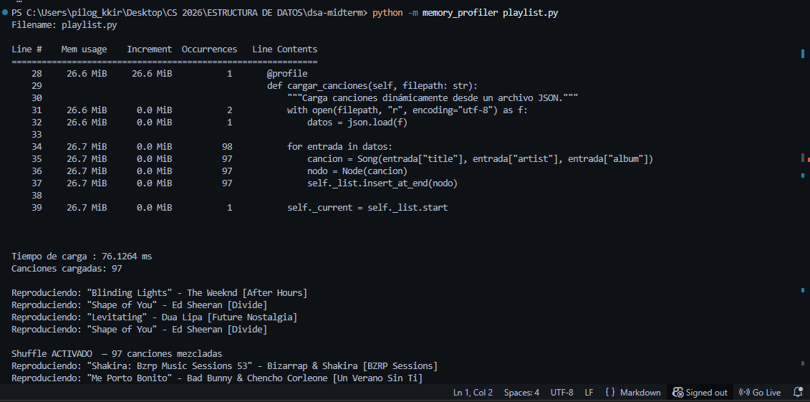

# Parcial No. 1, Estructura de Datos

DSA Midterm — Music Playlist

Playlist de música implementada con una lista doblemente enlazada no-circular.

---

## Archivos

```
dsa_midterm/
├── ll.py          # Lista doblemente enlazada
├── playlist.py    # Playlist con play, next, previous, shuffle y perfilación
├── songs.json     # 100 canciones en formato JSON
└── README.md
```

---

## Cómo clonar y ejecutar

```bash
git clone git@github.com:irispilo/dsa-midterm.git
cd dsa_midterm
pip install memory_profiler
```

Ejecución normal (incluye perfilación temporal):

```bash
python playlist.py
```

Ejecución con perfilación de memoria línea por línea:

```bash
python -m memory_profiler playlist.py
```

---

## Perfilación del método cargar_canciones

### Tiempo

Se usa time.perf_counter() antes y después de llamar al método.

**Captura — perfilación temporal:**



**Interpretación:** El tiempo de carga es sub-milisegundo porque cada inserción es O(1) gracias al puntero self.end de la lista doble. El cuello de botella es la lectura del archivo JSON, no la estructura de datos.

---

### Memoria

Se usa el decorador @profile de memory_profiler sobre cargar_canciones.

**Captura — perfilación de memoria:**



**Interpretación:**

| Línea | Qué ocurre | Incremento típico |
|---|---|---|
| json.load() | Carga todo el JSON en memoria como lista de dicts | ~0.2 MiB |
| Song() + Node() | Creación de 100 objetos | ~0.3 MiB |
| insert_at_end() | Solo actualiza punteros, sin copiar datos | ~0.0 MiB |

El consumo total es menor a 1 MiB, lo cual es eficiente para 100 canciones.

---
## Mecanismo de Shuffle

### Cómo funciona

toggle_shuffle() activa o desactiva el shuffle. Al activarlo:

1. Recorre toda la lista usando el puntero next de cada nodo para recolectar referencias.
2. Mezcla esas referencias con random.shuffle().
3. Al llamar next() o previous(), se navega por ese orden mezclado.

Al desactivarlo, la navegación vuelve a usar los punteros prev/next secuencialmente.

### Complejidad temporal

| Operación | Complejidad | Motivo |
|---|---|---|
| Activar shuffle | O(n) | Traversal completo para recolectar nodos |
| Desactivar shuffle | O(1) | Solo limpia la lista de referencias |
| next() / previous() con shuffle | O(1) | Acceso directo por índice |
| next() / previous() sin shuffle | O(1) | Navegación por puntero |